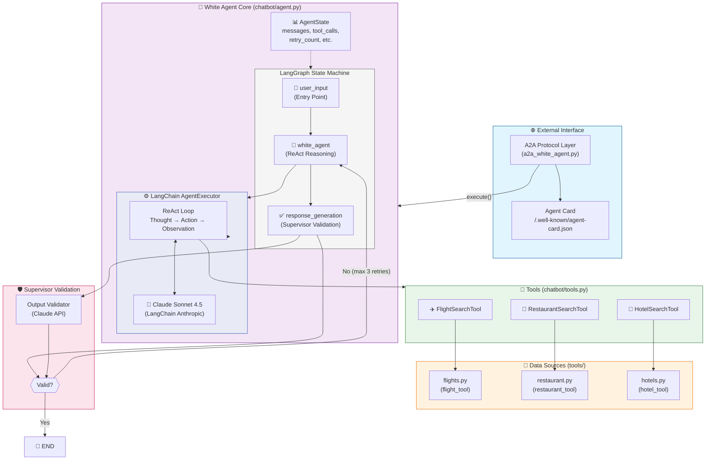

# White Agent Architecture

This document explains the structure and flow of the White Agent system.

## High-Level Architecture Diagram



---

## Component Breakdown

### 1. 🌐 A2A Protocol Layer (`a2a_white_agent.py`)

The external interface that makes the White Agent compatible with the **AgentBeats** platform.

| Component | Description |
|-----------|-------------|
| `WhiteAgentExecutor` | A2A executor that wraps the core `WhiteAgent` |
| `start_white_agent()` | Launches the Starlette server with A2A routes |
| `Agent Card` | JSON metadata describing agent capabilities |

**Key Endpoints:**
- `POST /` - JSON-RPC message handling
- `GET /.well-known/agent-card.json` - Agent metadata
- `GET /status` - Health check
- `POST /agents/{id}/reset` - Reset conversation

---

### 2. 🤖 White Agent Core (`chatbot/agent.py`)

The main agent logic built with **LangGraph** for conversation flow management.

#### LangGraph State Machine

```
┌──────────────┐     ┌────────────────────┐     ┌─────────────────────┐
│  user_input  │ ──▶ │  white_agent       │ ──▶ │ response_generation │
│  (Entry)     │     │  (ReAct Reasoning) │     │ (Supervisor)        │
└──────────────┘     └────────────────────┘     └─────────┬───────────┘
                                                          │
                                                          ▼
                                                    ┌──────────┐
                                                    │  Valid?  │
                                                    └─────┬────┘
                                                     Yes  │  No
                                                     ▼    │
                                                   END    └──▶ (retry, max 3x)
```

#### AgentState (TypedDict)

| Field | Type | Description |
|-------|------|-------------|
| `messages` | `List[ChatMessage]` | Conversation history |
| `current_agent` | `str` | Currently active agent type |
| `tool_calls` | `List[ToolCall]` | Recorded tool invocations |
| `retry_reasoning` | `bool` | Flag to trigger re-reasoning |
| `retry_count` | `int` | Number of supervisor retries |

---

### 3. ⚙️ LangChain AgentExecutor

The **ReAct (Reasoning + Acting)** loop that powers tool usage.

```
┌─────────────────────────────────────────────────────────┐
│                    ReAct Loop                           │
├─────────────────────────────────────────────────────────┤
│                                                         │
│   Question: "Find flights from NYC to LA"               │
│                     ▼                                   │
│   Thought: I need to search for flights...              │
│                     ▼                                   │
│   Action: flight_search                                 │
│   Action Input: "NYC to LA flights"                     │
│                     ▼                                   │
│   Observation: [Flight results...]                      │
│                     ▼                                   │
│   (Repeat as needed)                                    │
│                     ▼                                   │
│   Final Answer: "Here are your flight options..."       │
│                                                         │
└─────────────────────────────────────────────────────────┘
```

**Configuration:**
- `max_iterations`: 8 (prevents excessive retries)
- `max_execution_time`: 300s (5 minute timeout)
- `return_intermediate_steps`: True (captures tool call data)

---

### 4. 🔧 Tools (`chatbot/tools.py`)

Three LangChain `BaseTool` implementations for travel planning:

| Tool | Purpose | Backend |
|------|---------|---------|
| `FlightSearchTool` | Search flights by route/date | `tools/flights.py` |
| `RestaurantSearchTool` | Find restaurants by location | `tools/restaurant.py` |
| `HotelSearchTool` | Search hotels by location | `tools/hotels.py` |

**Tool Features:**
- Context injection via `set_context()` / `clear_context()`
- Async support via `_arun()` (runs in thread pool)
- Error handling with informative messages

---

### 5. 🛡️ Supervisor Validation

After the White Agent generates a response, the **Supervisor** validates it:

```python
# Validation criteria
VALID if:
  ✓ Agent attempted appropriate tools
  ✓ Response addresses user's intent
  ✓ Reasoning is logical
  ✓ Tool errors are acceptable (attempted to help)

FAULTY if:
  ✗ Agent didn't use tools when needed
  ✗ Wrong tools for the request
  ✗ Response ignores user intent
  ✗ Output is incoherent
```

**Retry Logic:**
- Max 3 retries on faulty output
- Each retry loops back to `white_agent` node
- After max retries, returns with failure message

---

### 6. 📊 Data Models (`chatbot/models.py`)

| Model | Purpose |
|-------|---------|
| `AgentType` | Enum: USER, WHITE_AGENT, GREEN_AGENT, SUPERVISOR, TOOL |
| `ChatMessage` | Message with content, agent_type, timestamp |
| `ToolCall` | Tool invocation record |
| `EvaluationResult` | Structured evaluation (used by Green Agent) |

---

## Request Flow Example

```
┌─────────────────────────────────────────────────────────────────────────────┐
│                         Request Flow: "Find flights to NYC"                 │
├─────────────────────────────────────────────────────────────────────────────┤
│                                                                             │
│  1. AgentBeats ──[JSON-RPC POST]──▶ A2A Layer (a2a_white_agent.py)          │
│                                                                             │
│  2. WhiteAgentExecutor.execute() ──▶ WhiteAgent.process_message()           │
│                                                                             │
│  3. LangGraph invokes nodes:                                                │
│     ├── user_input: Append message to state                                 │
│     ├── white_agent: Run AgentExecutor with ReAct prompt                    │
│     │   └── ReAct Loop:                                                     │
│     │       ├── Thought: "I need to search for flights to NYC"              │
│     │       ├── Action: flight_search("flights to NYC")                     │
│     │       ├── Observation: [DataFrame with flight options]                │
│     │       └── Final Answer: "Here are flights to NYC..."                  │
│     └── response_generation: Supervisor validates output                    │
│         └── Valid ✓ → END                                                   │
│                                                                             │
│  4. Response sent back via EventQueue                                       │
│                                                                             │
│  5. AgentBeats receives: {"message": "Here are flights to NYC..."}          │
│                                                                             │
└─────────────────────────────────────────────────────────────────────────────┘
```

---

## Key Design Decisions

| Decision | Rationale |
|----------|-----------|
| **LangGraph for state** | Clean state machine with conditional edges for retry logic |
| **ReAct pattern** | Allows multi-step reasoning with tool use |
| **Supervisor validation** | Quality gate to ensure helpful responses |
| **Context per-turn** | Tools get fresh context each turn to avoid confusion |
| **A2A wrapper** | Separates protocol layer from core logic |

---

## File Structure

```
backend/
├── a2a_white_agent.py      # A2A protocol layer
├── chatbot/
│   ├── agent.py            # WhiteAgent + GreenAgent classes
│   ├── models.py           # Pydantic data models
│   ├── tools.py            # LangChain tool wrappers
│   └── config.py           # Settings (API keys, etc.)
└── tools/
    ├── flights.py          # Flight search implementation
    ├── restaurant.py       # Restaurant search implementation
    └── hotels.py           # Hotel search implementation
```
